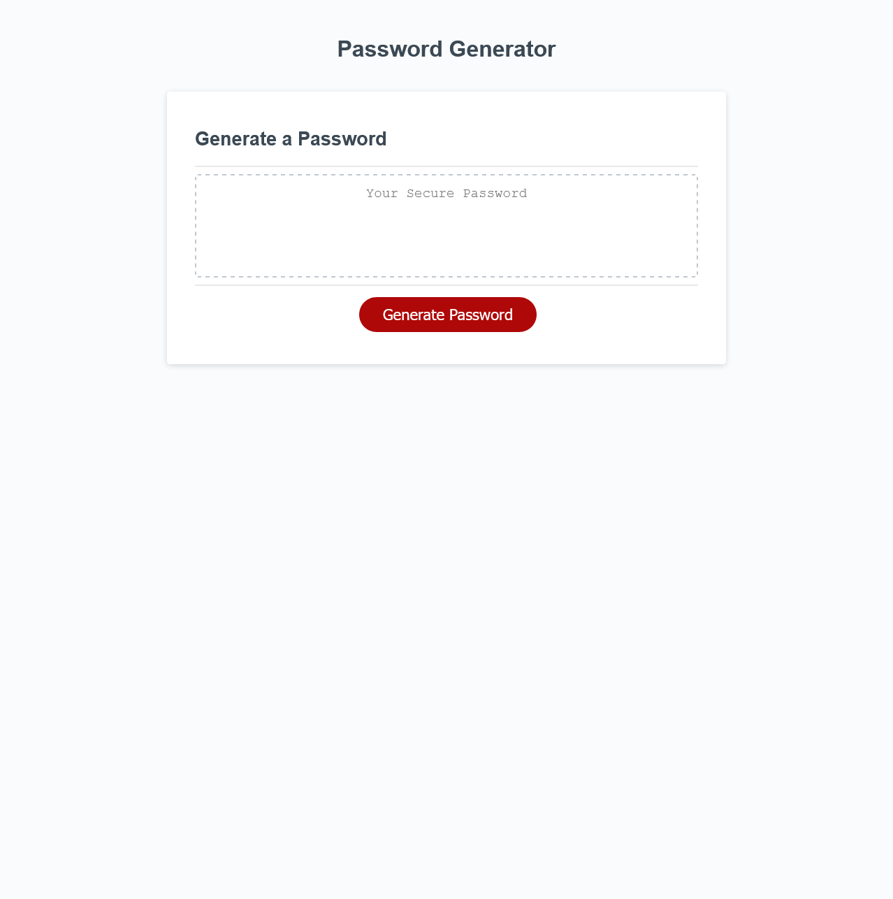

# Random Password Generator

The aim of this project was to create a website that randomly generates a password using certain criteria with the goal of creating a stronger password providing greater security.

## Technologies Used
* HTML 5
* CSS
* JavaScript

with a focus on javascript

---

---

## The following is a link to the live website.
https://p-fassbender.github.io/password-generator/
